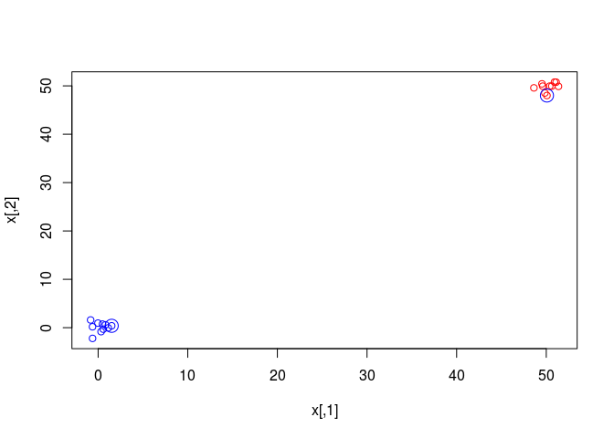
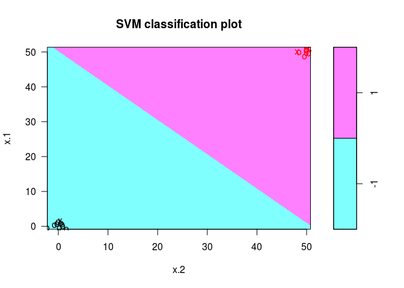
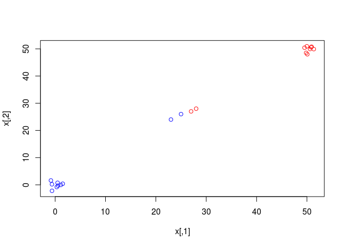
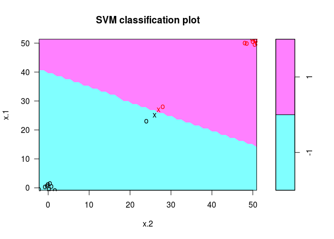
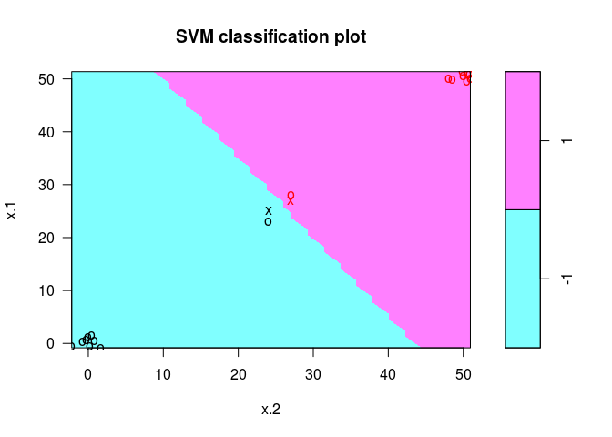
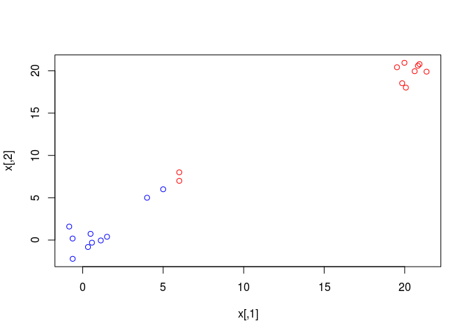
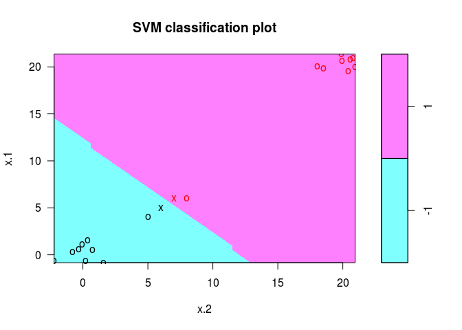
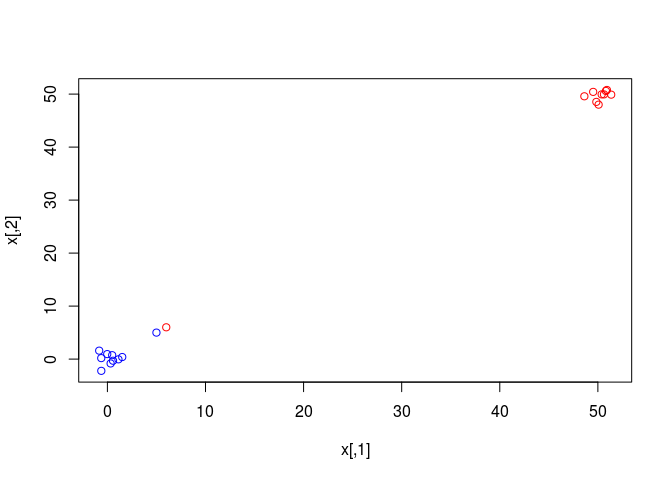
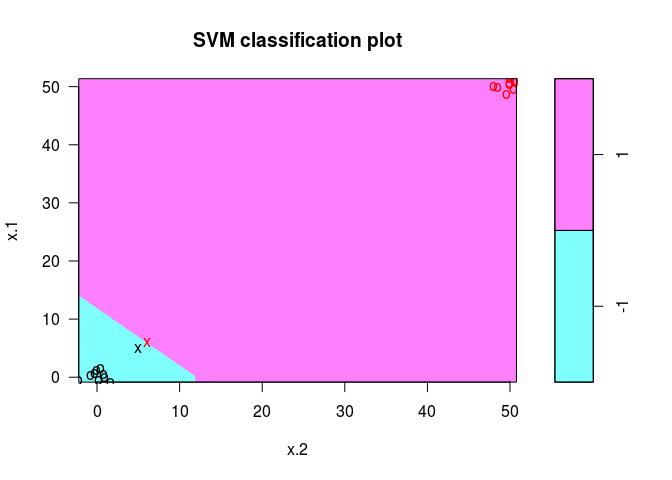

Support Vector Machine (SVM)
============================

Have you ever asked yourself how SVM works? I have done the following coding to show that how SVM is sensitive to the values close to the boundary.

